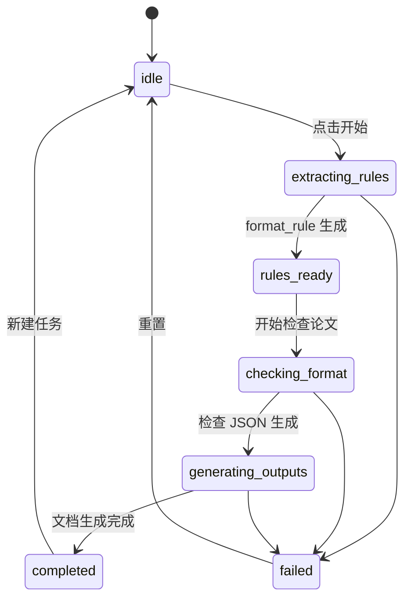

# 前端页面与交互说明

## 1. 页面目标

前端页面负责让用户完成模型选择、文件上传、任务启动、状态查看、错误统计查看和结果文件下载。

## 2. 页面区域

| 区域 | 内容 |
| --- | --- |
| 模型选择区 | 厂商下拉框、模型型号下拉框 |
| 文件上传区 | 格式规范文件上传、待检测论文上传 |
| 任务操作区 | 开始检查按钮、重置按钮 |
| 状态展示区 | 当前阶段、错误信息、耗时 |
| 规则文件区 | `format_rule.json` 下载链接 |
| 错误统计区 | 总错误数、严重程度分布、类别分布 |
| 错误明细区 | 错误列表、位置、原因、建议 |
| 结果下载区 | 错误统计分析文档、批注版论文下载链接 |

## 3. 表单校验

- 模型厂商不能为空。
- 模型型号不能为空。
- 格式规范文件不能为空。
- 待检测论文不能为空。
- 待检测论文优先提示使用 `.docx`。
- 文件上传成功后展示文件名和大小。

## 4. 状态交互

## 5. 错误统计展示

前端从 `format_check_result.json.statistics` 读取：

- `total_issues`
- `by_category`
- `by_severity`
- `need_manual_confirmation`
- `checked_rule_count`

推荐展示：

- 顶部数字卡片：错误总数、严重错误数、需人工确认数。
- 分类统计表：每类错误数量。
- 严重程度统计：high、medium、low。
- 错误明细表：ID、位置、问题、原因、建议。

## 6. 下载链接

流程完成后至少展示：

| 链接 | 来源 |
| --- | --- |
| 下载格式规范 JSON | `format_rule.json` |
| 下载错误统计分析文档 | `format_check_analysis.docx` |
| 下载批注版论文 | `checked_file_annotated.docx` |

当前版本待检测论文只允许 `.docx`。如果文件不是 DOCX，前端应直接阻止提交并提示当前版本只支持 Word 论文检测。

## 7. 前端不负责的事项

- 不直接解析文档格式。
- 不直接调用 prompt。
- 不直接修改论文。
- 不直接生成 Word 批注。

## 8. 已确认前端实现要求

- 前端技术栈为 Vue。
- 模型厂商下拉选项包括：`deepseek`、`chatgpt`、`claudecode`、`kimi`、`glm`。
- 前端不提供 API Key 和 Base URL 输入框。
- 前端不支持 temperature、max_tokens 等高级参数配置。
- 前端必须展示错误明细表。
- 前端不预览原始上传文件。
- 前端提供下载入口：
  - `format_rule.json`
  - `format_check_analysis.docx`
  - `checked_file_annotated.docx`
- 前端不允许用户手动编辑 `format_rule.json` 后继续检查。

## 9. 文件格式校验

| 文件 | 前端校验 |
| --- | --- |
| 格式规范文件 | 允许 `.pdf`、`.doc`、`.docx`、`.md` |
| 待检测论文 | 当前只允许 `.docx` |

如果待检测论文不是 `.docx`，前端应直接阻止提交并提示：当前版本只支持 Word 论文检测。
