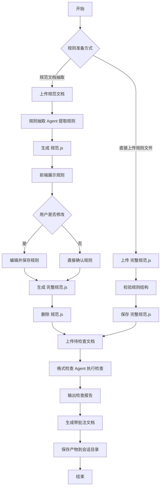
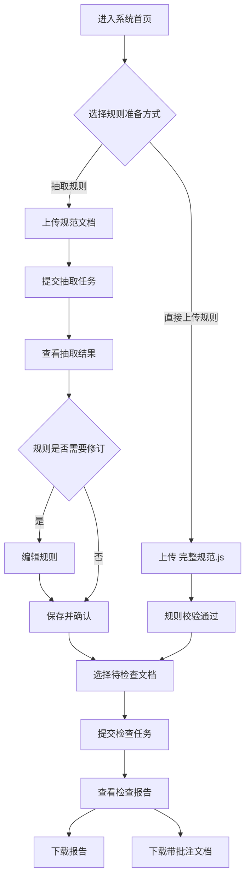
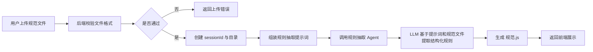
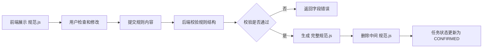
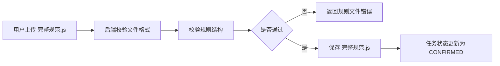
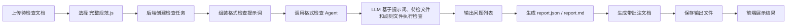
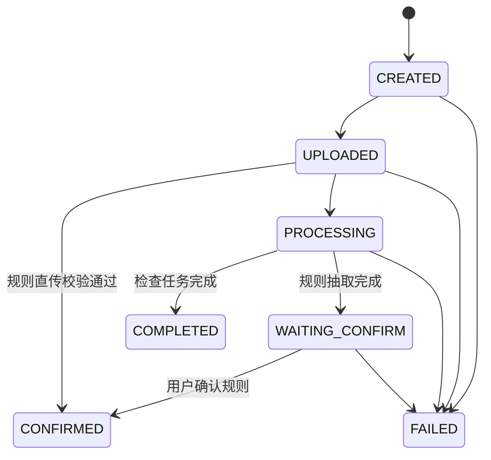

# 业务流程图 / 用户流程图

## 1. 业务总流程

## 2. 用户流程图

## 3. 规则抽取业务流程

## 4. 规则确认业务流程

## 5. 规则直传业务流程

## 6. 格式检查业务流程

## 7. 任务状态流转图

## 8. 关键页面流程说明

### 7.1 规范抽取页

- 用户上传规范文档
- 系统返回任务编号和抽取状态
- 抽取完成后跳转到规则确认页

### 7.2 规则直传页

- 用户上传 `完整规范.js`
- 系统执行规则结构校验
- 校验通过后可直接用于格式检查

### 7.3 规则确认页

- 以分类表单或树形结构展示抽取结果
- 支持新增、删除、修改规则项
- 点击确认后生成 `完整规范.js`

### 7.4 格式检查页

- 用户上传待检文档
- 选择已确认规则会话，规则可来自抽取模式或直传模式
- 提交后进入结果等待状态

### 7.5 结果页

- 展示问题摘要
- 展示问题清单
- 下载报告
- 下载带批注文档
