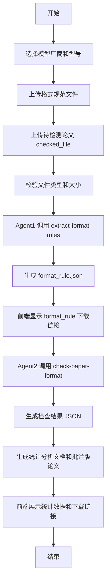

# 流程设计

## 1. 主流程



## 2. Agent1 规则抽取流程

1. 读取用户上传的格式规范文件。
2. 根据文件类型选择解析方式。
3. 构造 `extract_rule_prompt` 输入。
4. 调用用户选择的模型。
5. 获取 LLM 输出 JSON。
6. 使用 `save_rule_json.py` 清洗、校验、保存。
7. 生成 `format_rule.json` 下载信息。

## 3. Agent2 格式检查流程

1. 读取 `format_rule.json`。
2. 读取 `checked_file`。
3. 提取论文中的文本、结构和格式信息。
4. 构造 `format_check_prompt` 输入。
5. 调用用户选择的模型。
6. 获取 LLM 输出 JSON。
7. 使用 `build_format_check_outputs.py` 生成：
   - `format_check_result.json`
   - `format_check_analysis.docx`
   - `format_check_analysis.md`
   - `checked_file_annotated.docx`
8. 返回统计数据和下载链接给前端。

## 4. 异常流程

| 场景 | 处理 |
| --- | --- |
| 未选择模型 | 前端禁止提交并提示用户选择 |
| 缺少规范文件 | 前端禁止提交 |
| 缺少待检测论文 | 前端禁止提交 |
| 规范文件内容为空 | Agent1 失败，提示文件无法解析 |
| LLM 输出非法 JSON | 保存原始输出，提示重试 |
| `format_rule.json` 为空 | 停止 Agent2 |
| 待检论文不是 DOCX | 前端或 Java 接口直接拒绝，当前版本不进入 Agent2 |
| 批注锚文本未找到 | 在统计文档中保留问题，并记录未批注 issue |

## 5. 前端状态

| 状态 | 含义 |
| --- | --- |
| `idle` | 等待用户选择模型和上传文件 |
| `extracting_rules` | Agent1 正在抽取规则 |
| `rules_ready` | `format_rule.json` 已生成 |
| `checking_format` | Agent2 正在检查论文 |
| `generating_outputs` | 正在生成结果文件 |
| `completed` | 结果可查看和下载 |
| `failed` | 流程失败，展示错误信息 |

## 6. 已确认流程细节

1. 前端使用 Vue。
2. 前端将模型厂商、模型型号、规范文件、待检测论文提交给 Java Spring Boot。
3. Java 保存原始上传文件，并按待检测文档名创建结果目录。
4. Java 使用 `ProcessBuilder` 启动 Python 脚本执行 Agent1。
5. Python 根据本地配置调用外部模型 API，生成 `format_rule.json`。
6. Java 获取 `format_rule.json` 路径并返回下载链接。
7. Java 使用 `ProcessBuilder` 启动 Python 脚本执行 Agent2。
8. Python 优先用程序读取 Word 属性完成格式检查，错别字和语法错误交给 LLM 判断。
9. Python 生成 `.docx` 错误统计分析文档和 Word 原生批注版论文。
10. Java 返回错误统计数据、错误明细表数据和两个结果文件下载链接。

## 7. 文件命名流程

如果待检测论文为：

```text
单奕翔：变化中的永恒——论中国民间音乐的“循环”逻辑.docx
```

则结果目录使用清洗后的文档名，例如：

```text
results/单奕翔_变化中的永恒_论中国民间音乐的_循环_逻辑/
```

该目录长期保留，不自动清理。

目录内部固定为：`待检测文件`、`规则规范文件`、`规则抽取结果`、`检测结果`、`检测后带批注的源文件`。
