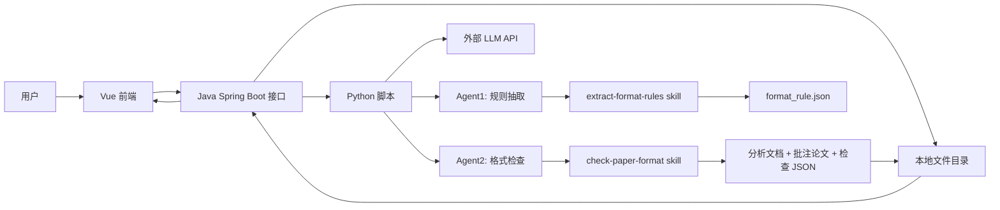
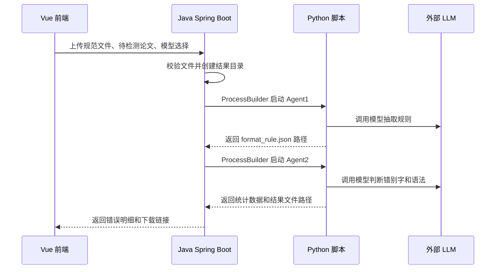

# 系统架构设计

## 1. 架构概览

系统采用单机本地架构。前端使用 Vue，后端接口使用 Java Spring Boot，LLM 交互和 Agent 执行使用 Python。Java 不直接调用 LLM，而是通过 `ProcessBuilder` 启动 Python 脚本。

## 2. 模块职责

| 模块 | 技术 | 职责 |
| --- | --- | --- |
| 前端页面 | Vue | 模型选择、文件上传、状态展示、错误明细表、下载入口 |
| 接口层 | Java Spring Boot | 提供 REST API、保存上传文件、创建目录、启动 Python、返回结果 |
| Agent/LLM 层 | Python | 调用外部 LLM API、执行 Agent1/Agent2、读取 Word 属性、生成结果文件 |
| 本地文件管理 | Java + Python | 按待检测文件目录保存五类文件 |
| Skill | Markdown + 脚本 | 约束 Agent 输出结构和结果生成方式 |

## 3. Java 启动 Python

当前方案固定为 Java 使用 `ProcessBuilder` 启动 Python 脚本。

Java 负责：

- 接收前端请求。
- 校验文件类型。
- 创建结果目录。
- 将请求参数写入 JSON 文件。
- 启动 Python 脚本。
- 读取 Python 返回的 JSON 结果。

Python 负责：

- 根据 provider/model 读取本地 API Key 和 Base URL。
- 调用外部模型 API。
- 执行规则抽取和格式检查。
- 生成 `format_rule.json`、检查结果 JSON、分析文档、批注版论文。

## 4. Agent 关系

Agent1 和 Agent2 串行执行。Agent2 依赖 Agent1 的 `format_rule.json`。

## 5. 文件分类目录

结果目录按待检测文件划分，例如 `results/善意想/`。目录内部固定为五类：

| 分类目录 | 内容 |
| --- | --- |
| `待检测文件` | 用户上传的待检测 `.docx` |
| `规则规范文件` | 用户上传的规范文件 |
| `规则抽取结果` | Agent1 生成的 `format_rule.json` |
| `检测结果` | `format_check_result.json`、`format_check_analysis.docx`、可选 Markdown |
| `检测后带批注的源文件` | Word 原生批注版论文 |

## 6. 检查责任边界

- 程序负责读取 Word 样式、页边距、字体、字号、段落、标题、表格、页眉页脚等可程序化属性。
- LLM 负责规范规则抽取、错别字和语法错误判断，以及无法稳定程序化的语义判断。
- 所有可程序化格式规则优先由程序判断。
- 批注版论文必须使用 Word 原生 comments。

## 7. 错误处理原则

- 规范文件解析失败：停止 Agent1，提示用户更换文件或检查文件内容。
- `format_rule.json` 校验失败：不进入 Agent2。
- 待检测论文不是 `.docx`：前端或 Java 接口直接拒绝，当前版本不进入 Agent2。
- LLM 输出不是合法 JSON：保存原始输出用于排查，并返回失败。
- 批注定位失败：统计报告保留问题，并记录未定位 issue。
