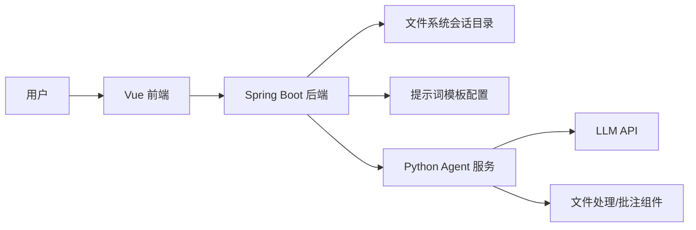
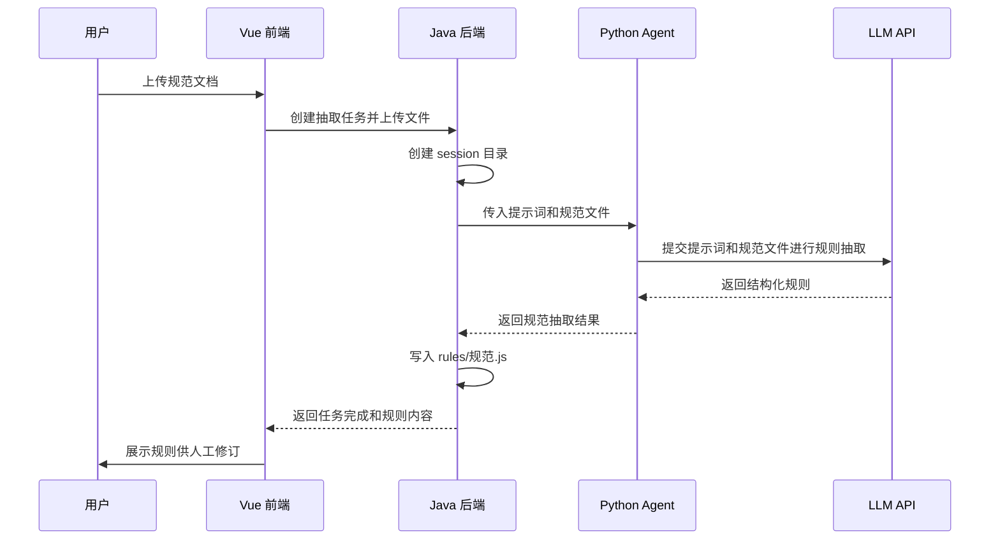
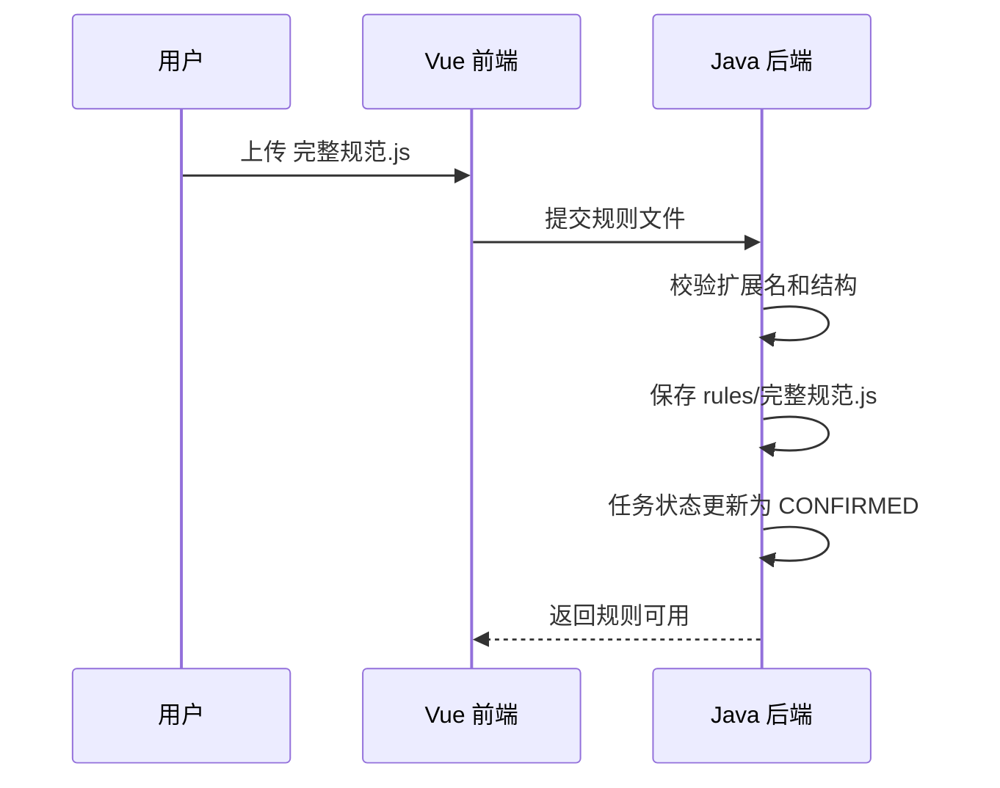
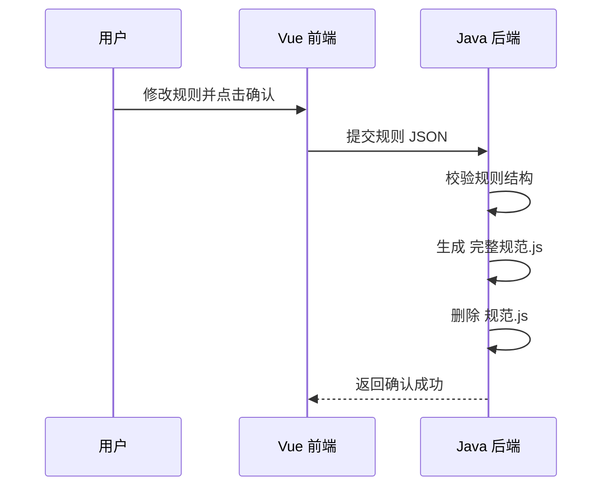
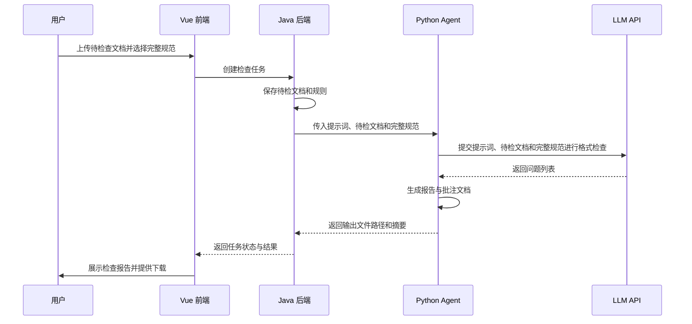

# 软件设计说明

## 1. 设计目标

本系统采用“Java 业务编排 + Python Agent 服务 + Vue 前端 + 文件系统存储”的分层架构。设计重点如下：

- 前后端职责清晰
- LLM 能力通过独立 Agent 服务封装
- 不依赖数据库也能完成单机会话管理
- 输出文件可追踪、可下载、可回放
- 同时支持“规则抽取”和“规则直传”两种规则准备路径
- Agent 输入统一采用“提示词 + 原始文件”模式
- 为后续引入数据库、规则模板库、权限系统保留扩展点

## 2. 总体架构



## 3. 技术选型

- 前端：Vue 3、Vue Router、Pinia、Element Plus 或 Ant Design Vue
- 后端：Java 23、Spring Boot 3.x
- ORM：MyBatis-Plus
- Agent 服务：Python 3.10、FastAPI
- 文档处理：Python `python-docx`、`pymupdf`、`pypdf` 等按文档类型选型
- 文件存储：本地文件系统
- 接口文档：OpenAPI 3.0 / Swagger

说明：当前版本不使用数据库，MyBatis-Plus 作为后续持久化演进预留。V1 可以先采用文件存储仓储实现，保留 Repository 接口层。

## 4. 系统模块设计

### 4.1 前端模块

- 规范抽取页面
- 规则编辑页面
- 格式检查提交页面
- 检查结果页面
- 任务详情页面
- 通用上传组件
- 规则树/表单编辑组件

### 4.2 Java 后端模块

- `SessionController`：会话创建、查询、文件上传、结果下载
- `RuleController`：规则抽取任务发起、规则读取、规则确认保存
- `RuleImportController`：完整规则文件直传、校验、落盘
- `CheckController`：检查任务发起、结果查询
- `TaskService`：任务生命周期管理
- `StorageService`：会话目录和文件操作
- `PromptTemplateService`：规则抽取与格式检查提示词管理
- `AgentClient`：调用 Python Agent 服务
- `RuleMapper/TaskMapper`：后续数据库演进保留

### 4.3 Python Agent 模块

- `extractor_agent`：规则抽取 Agent
- `checker_agent`：格式检查 Agent
- `prompt_manager`：提示词模板加载与组装
- `file_adapter`：原始文件定位、上传与回传适配
- `rule_serializer`：规则结构标准化与 `规范.js` 生成
- `rule_validator`：`完整规范.js` 结构校验
- `annotation_writer`：批注写回
- `report_builder`：报告生成

## 5. 部署形态

### 5.1 开发环境

- Vue 开发服务器
- Spring Boot 服务
- Python FastAPI Agent 服务
- 本地文件目录作为存储根目录

### 5.2 生产环境建议

- Nginx 代理前端与后端
- Spring Boot 单独部署
- Python Agent 服务单独部署
- 共享文件存储或对象存储
- 后续可加 Redis 处理异步任务队列

## 6. 核心数据模型

### 6.1 会话目录结构

```text
storage/
  sessions/
    {sessionId}/
      meta.json
      source/
        standard.docx
        target.docx
        完整规范.js
      rules/
        规范.js
        完整规范.js
      output/
        report.json
        report.md
        target.annotated.docx
      logs/
        agent-request.json
        agent-response.json
```

### 6.2 会话元数据 `meta.json`

```json
{
  "sessionId": "sess_20260421_001",
  "type": "RULE_EXTRACTION",
  "status": "COMPLETED",
  "createdAt": "2026-04-21T10:00:00+08:00",
  "updatedAt": "2026-04-21T10:02:31+08:00",
  "ruleVersion": 1,
  "standardFileName": "文档编写规范.docx",
  "ruleSource": "EXTRACTED",
  "targetFileName": null
}
```

### 6.3 规则文件结构建议

`完整规范.js` 建议输出 CommonJS 或 ESM 可直接加载的对象，字段保持稳定。

当前设计将该文件收敛为“规则项数组”模型。每条规则必须显式说明：

- 检查谁：`scope`
- 检查什么：`check_object`
- 严重程度：`severity`
- 依据是什么：`source_text`
- 适用范围是什么：`applicable_sections`

```javascript
module.exports = [
  {
    rule_id: "R001",
    category: "格式规范",
    scope: "一级标题",
    rule_name: "一级标题字体字号要求",
    description: "一级标题应使用黑体三号，居中，段前后间距符合规范",
    check_type: "hybrid",
    check_object: [
      "font_family",
      "font_size",
      "alignment",
      "spacing_before",
      "spacing_after"
    ],
    expected: {
      font_family: "黑体",
      font_size: "三号",
      alignment: "center"
    },
    severity: "high",
    source_text: "规范原文中的对应条款",
    applicable_sections: ["title_level_1"],
    user_confirmed: true
  }
];
```

### 6.4 检查报告结构建议

```json
{
  "sessionId": "sess_20260421_002",
  "summary": {
    "totalIssues": 8,
    "criticalIssues": 1,
    "majorIssues": 4,
    "minorIssues": 3
  },
  "issues": [
    {
      "id": "ISSUE-001",
      "location": {
        "page": 3,
        "paragraphIndex": 12,
        "heading": "2.1 系统架构"
      },
      "ruleId": "R001",
      "ruleName": "一级标题字体字号要求",
      "sourceText": "规范原文中的对应条款",
      "applicableSections": ["title_level_1"],
      "checkObject": ["font_family", "font_size", "alignment"],
      "actualValue": "left",
      "expectedValue": "center",
      "reason": "二级标题字号不符合规范要求",
      "suggestion": "将二级标题调整为小三号",
      "severity": "MAJOR"
    }
  ]
}
```

## 7. 关键流程设计

### 7.1 规范抽取流程



### 7.2 完整规则直传流程



### 7.3 规则确认流程



### 7.4 格式检查流程



## 8. 后端分层设计

### 8.1 Controller 层

负责 HTTP 入参校验、响应封装、状态码控制，不处理复杂业务。

### 8.2 Service 层

负责：

- 会话状态流转
- 文件落盘
- 调用 Agent
- 任务结果整合

### 8.3 Repository 层

V1 使用文件系统仓储实现：

- `FileSessionRepository`
- `FileRuleRepository`
- `FileReportRepository`

后续接入数据库时可替换为 MyBatis-Plus 实现。

## 9. Agent 接口设计

### 9.1 规则抽取 Agent 输入

- 规则抽取提示词
- 规范文档文件路径
- 会话 ID
- 输出目录

### 9.2 规则抽取 Agent 输出

- 结构化规则对象
- 抽取置信说明
- 未识别项提示

### 9.3 格式检查 Agent 输入

- 格式检查提示词
- 待检查文档文件路径
- `完整规范.js`
- 检查粒度参数

### 9.4 格式检查 Agent 输出

- 问题列表
- 报告文件内容
- 批注文档输出路径

## 10. 状态机设计

### 10.1 任务状态

- `CREATED`
- `UPLOADED`
- `PROCESSING`
- `WAITING_CONFIRM`
- `CONFIRMED`
- `COMPLETED`
- `FAILED`

### 10.2 状态流转规则

#### 规则抽取任务

`CREATED -> UPLOADED -> PROCESSING -> WAITING_CONFIRM -> CONFIRMED`

#### 规则直传任务

`CREATED -> UPLOADED -> CONFIRMED`

#### 格式检查任务

`CREATED -> UPLOADED -> PROCESSING -> COMPLETED`

异常场景统一进入 `FAILED`。

## 11. 异常处理设计

### 11.1 上传异常

- 文件类型不支持：返回 400
- 文件过大：返回 413
- 文件保存失败：返回 500

### 11.2 Agent 异常

- Agent 服务不可达：返回 503
- Agent 超时：返回 504
- LLM 返回结构不合法：任务置为 `FAILED`

### 11.3 文件处理异常

- 批注写入失败时，仍保留报告结果，但任务状态标记为部分成功或返回扩展错误码

## 12. 日志与可观测性

- 每个任务记录 `traceId`
- Java 与 Python 请求头传递 `traceId`
- 记录请求开始、结束、耗时、结果状态
- 产物目录中保留请求摘要日志，便于排错

## 13. 安全设计

- 文件名标准化处理，防止路径注入
- 上传目录按 `sessionId` 隔离
- 返回下载链接时做路径白名单校验
- 限制脚本、可执行文件上传

## 14. 可扩展性设计

- 规则 schema 支持新增章节类规则
- 存储层可从本地文件扩展到 OSS/MinIO
- Agent 调用可从 HTTP 扩展到消息队列
- 检查结果可进一步支持自动修复模式

## 15. 建议的项目目录

```text
format-check/
  backend/
    src/main/java/...
  agent-service/
    app/
      api/
      agents/
      services/
      models/
      utils/
  frontend/
    src/
      views/
      components/
      api/
      stores/
  storage/
    sessions/
  docs/
```
